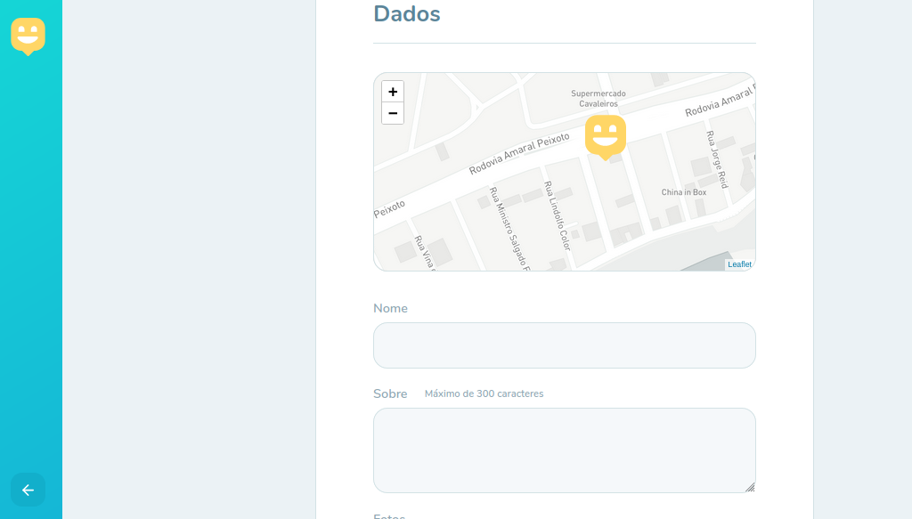
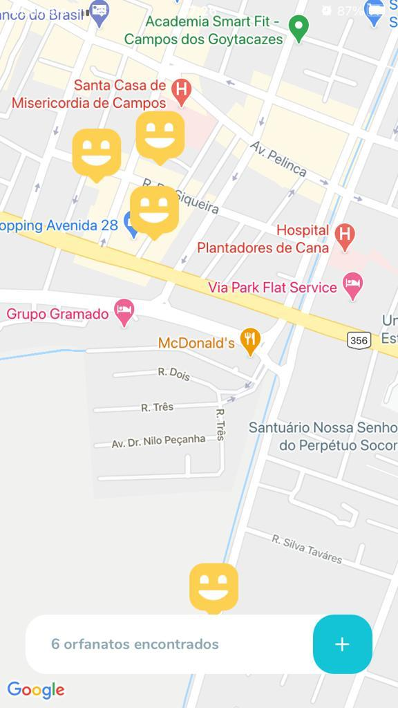
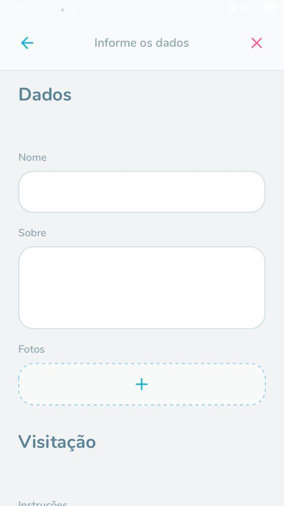

<h1 align="center">
  
</h1>

## 📌 Index

- [About](#-about)
- [Screenshots](#-screenshots)
- [Techs](#-techs)
- [Contributions](#-contributions)
- [License](#-license)

## About

### :rocket: An app made to connect orphanages with potential visitors, using [React](https://pt-br.reactjs.org/), [Node.js](https://nodejs.org/en/) and [React Native](https://reactnative.dev/).

> This project was developed with the [@Rockeseat](https://github.com/Rocketseat) team at the Next Level Week #3. You can see the full project [here](https://github.com/jpc0rrea/nlw-happy-omnistack), this repository is only for the web frontend.

## 📸 Screenshots

### 💻 Web

  
  

### 📱 Mobile

  
  

## 🖥 Techs

- **Web**

  - [React](https://reactjs.org/)
  - [Typescript](https://www.typescriptlang.org/)
  - [Mapbox](https://www.mapbox.com/)
  - [Leaflet](https://leafletjs.com/)
  - [React Leaflet](https://react-leaflet.js.org/)

## 🤝 Contributions

Follow the steps below to contribute:

1. Fork the project (<https://github.com/jpc0rrea/happy-web-deploy>)

2. Clone your fork to your machine (`git clone https: // github.com / user_name / happy.git`)

3. Create a branch to perform your modification (`git checkout -b feature / name_new_feature`)

4. Add your modifications and commit (`git commit -m" Describe your modification "`)

5. Push (`git push origin feature / name_new_feature`)

6. Create a new Pull Request

7. Wait for the analysis 🚀

## 📜 License

This project is under the [MIT](./LICENSE) license.
